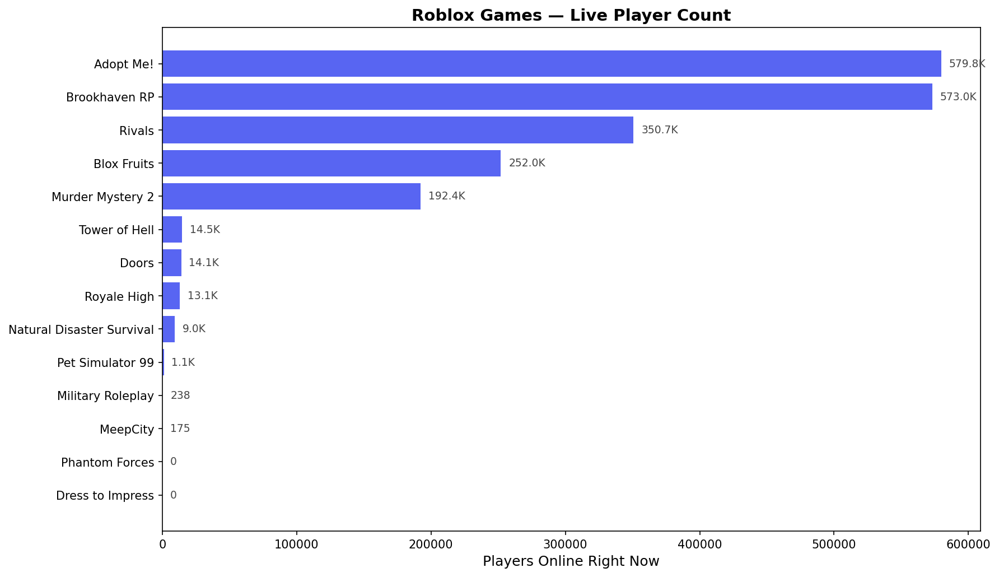
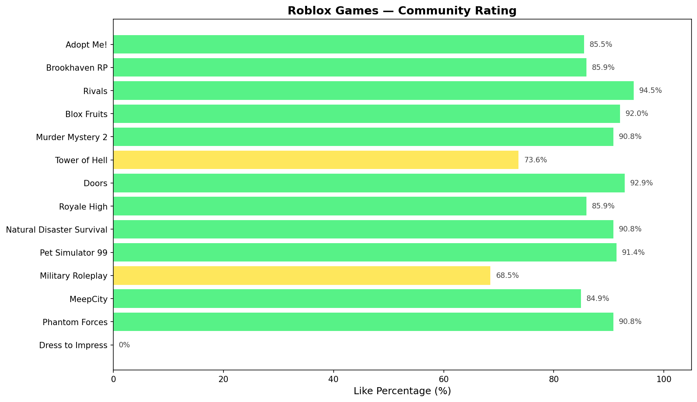
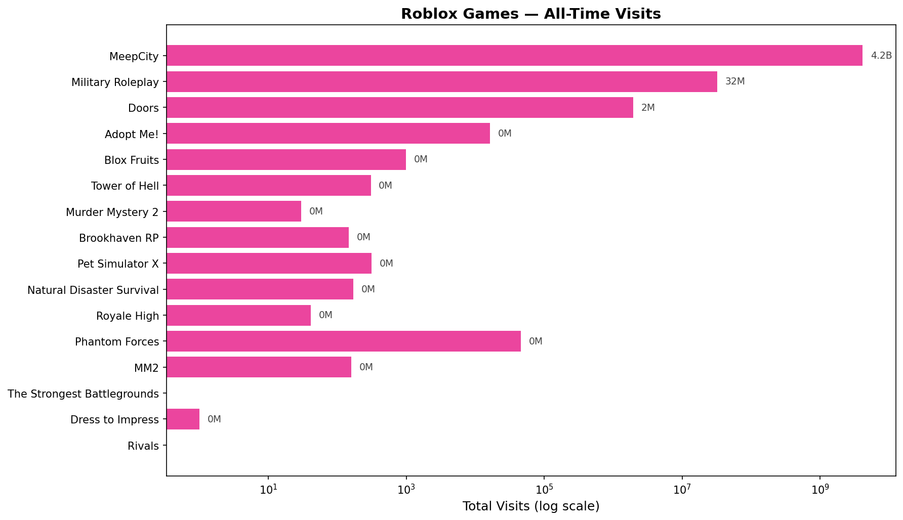

# Roblox Game Stats Scraper

Scrapes live player counts, total visits, favorites, and community ratings for top Roblox games using the public Roblox API. Saves data to CSV and generates visual charts.

## Features

- Pulls real-time stats from the Roblox Games API (no auth required).
- Tracks 16 popular games out of the box — easily configurable.
- Exports data to CSV for further analysis.
- Generates three charts: live player count, community rating, and all-time visits.
- Tracking mode: run on a loop to collect data over time and spot trends.

## Charts

| Live Players | Community Rating | All-Time Visits |
|:---:|:---:|:---:|
|  |  |  |

## Setup

```bash
# Clone the repo
git clone https://github.com/UnknownHacker9991/roblox-game-stats.git
cd roblox-game-stats

# Install dependencies
pip install requests pandas matplotlib
```

## Usage

```bash
# Scrape once — saves CSV + generates charts
python scraper.py

# Track over time — scrapes every 30 min
python scraper.py --track
```

## Adding/Removing Games

Edit the `GAMES` list in `scraper.py`. Each entry is a `(universe_id, "Game Name")` tuple.

To find a game's Universe ID:
1. Go to the game's page on roblox.com
2. Copy the Place ID from the URL
3. Visit: `https://apis.roblox.com/universes/v1/places/PLACE_ID/universe`

## Output

- `data/roblox_stats.csv` — all scraped data (appends over time)
- `charts/player_count.png` — horizontal bar chart of live players
- `charts/like_percentage.png` — community like % per game
- `charts/total_visits.png` — all-time visits (log scale)

## Built With

- Python 3
- [requests](https://docs.python-requests.org/) — HTTP requests
- [matplotlib](https://matplotlib.org/) — chart generation
- [Roblox Games API](https://games.roblox.com/docs) — public game data

## License

MIT
